<!-- _class: titular -->

# Разработка для начинающих: фронтенд vs. бэкенд

---

<!-- _class: author -->
<div class="author-card">
    
    <div class="author-text">
        <span class="author-name">Михаил Кононенко</span>
        <span class="author-tg"><a href="https://t.me/vbifonix"><i class="icon-send"></i>@vbifonix</a></span>
        <span class="author-resume">
            Фронтенд-разработчик в 
        </span>
    </div>
</div>

<div class="author-card">
    
    <div class="author-text">
        <span class="author-name">Тимофей Житков</span>
        <span class="author-tg"><a href="https://t.me/timondecathlon"><i class="icon-send"></i>@timondecathlon</a></span>
        <span class="author-resume">
            Senior Fullstack-разработчик в 
        </span>
    </div>
</div>

---


<!-- _transition: fade .1s -->

---
<!-- _transition: fade .1s -->

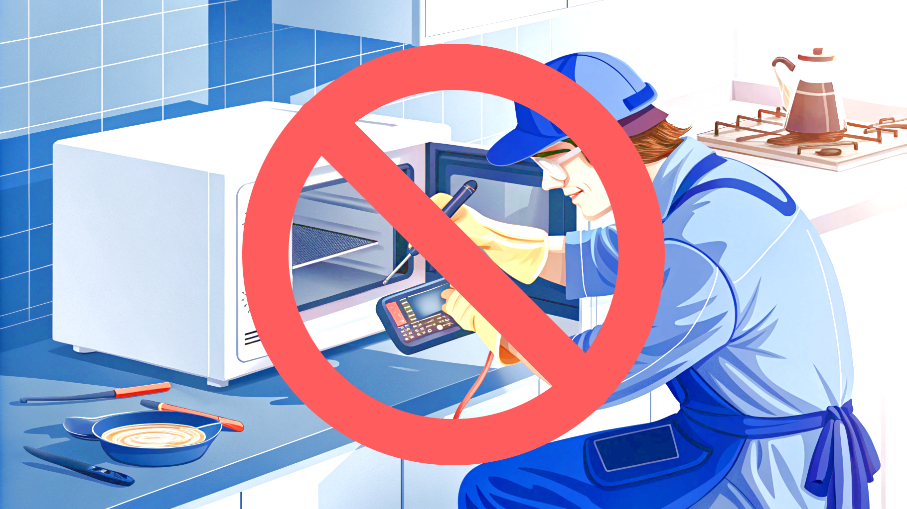

---


---


---

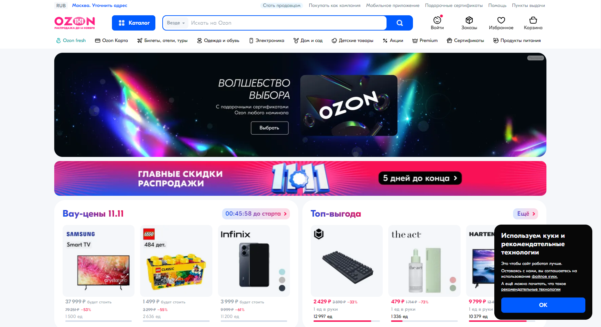

---


---

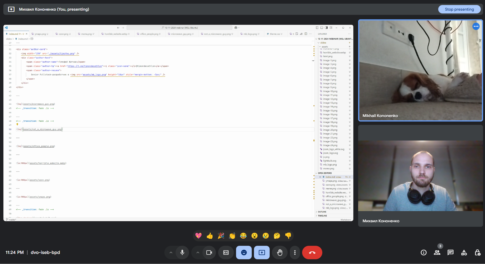

---


---

<!-- _transition: fade .1s -->


---
<!-- _transition: fade .1s -->


---
<!-- _transition: fade .1s -->


---
<!-- _transition: fade .1s -->


---
<!-- _transition: fade .1s -->


---
<!-- _transition: fade .1s -->


---
<!-- _transition: fade .1s -->

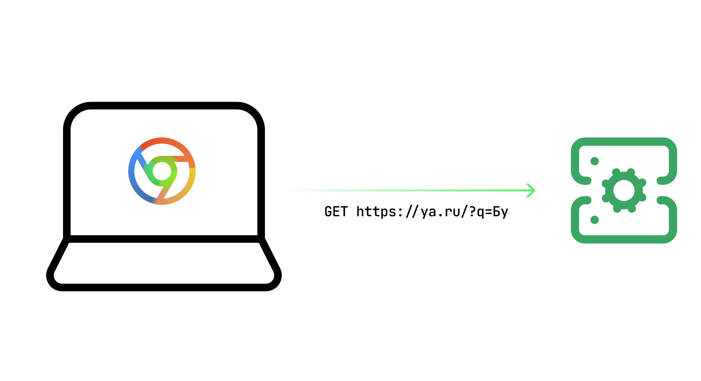

---
<!-- _transition: fade .1s -->


---
<!-- _transition: fade .1s -->

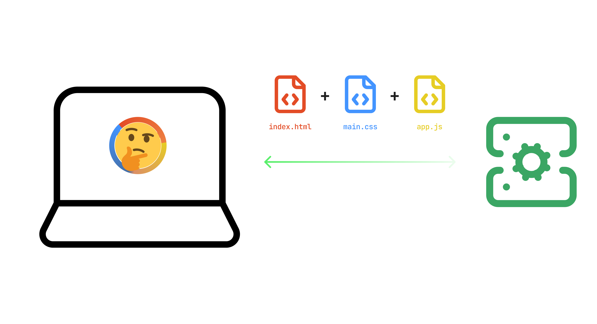

---
<!-- _transition: fade .1s -->

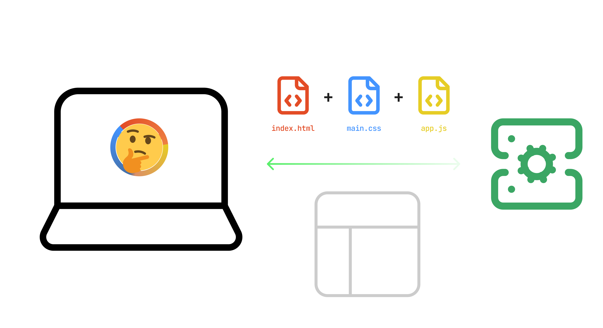

---
<!-- _transition: fade .1s -->


---

<!-- _transition: fade .1s -->

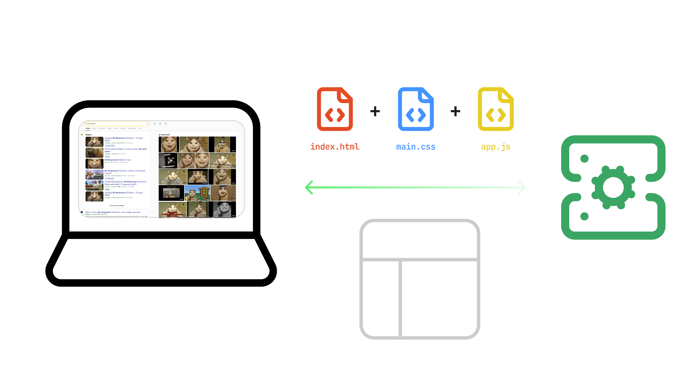

---
<!-- _transition: fade .1s -->


---
<!-- _transition: fade .1s -->


---
<!-- _transition: fade .1s -->


---
<!-- _transition: fade .1s -->


---
<!-- _transition: fade .1s -->


---

<!-- _transition: fade .1s -->


---
<!-- _transition: fade .1s -->


---


---

# За что платят фронтендеру?

---

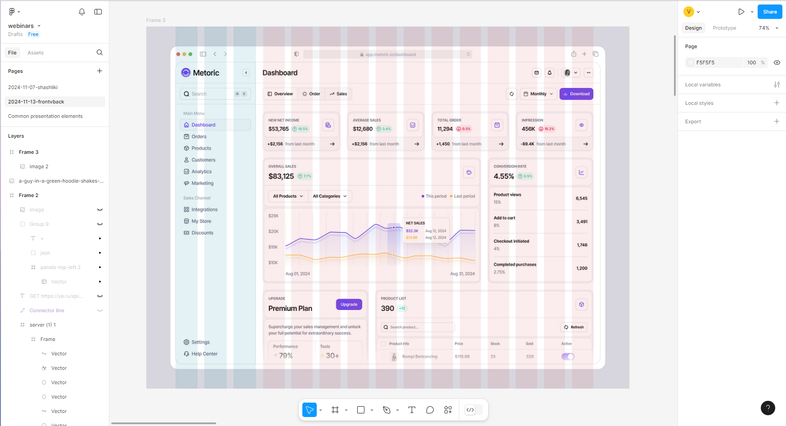

<!-- _footer: '[Metoric Sales Analytics от Barly Design @ dribble](https://dribbble.com/shots/24801899-Metoric-Sales-Analytics)' -->

---
<!-- Кроме того, что контент показался - важно, чтобы можно было заказать сырную шавуху -->
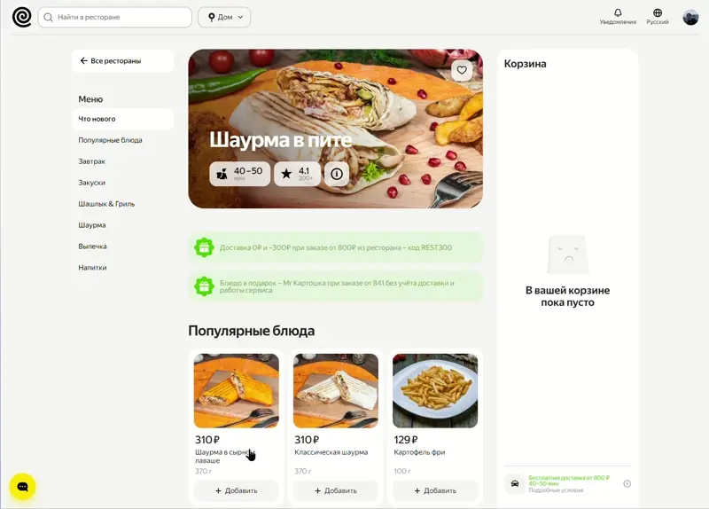

---
<!-- Оживляем интерфейс -->
<button class="scared animated" onclick="javascript:(() => {let a = document.querySelector('.scared'); a.innerText = 'ЛАДНО НЕ БУДУ'; a.classList.add('away'); setTimeout(() => a.remove(), 5000)})()">ДА НЕ ТРЯСИСЬ ТЫ</button>

---


---
<!-- Адаптивная вёрстка -->


---

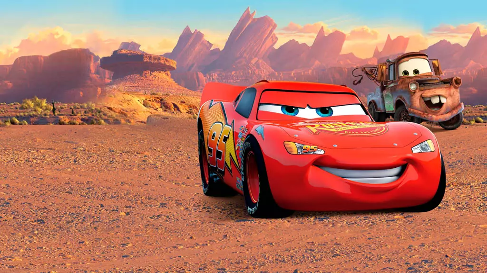

---

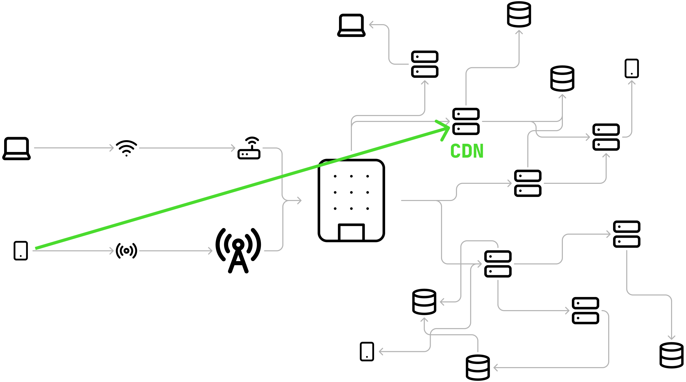

---

<!-- _footer: '[Web Vitals](https://web.dev/articles/vitals?hl=ru)' -->

---


<!-- Один мой знакомый занимается веб-разработкой даже несмотря на то, что лишился зрения -->
<!-- _footer: '[Сайт социального фонда России](https://sfr.gov.ru)' -->

---


<!-- _footer: '[Super busy UI @ dribble.com](https://dribbble.com/shots/15347979-Super-busy-UI)' -->

---


---

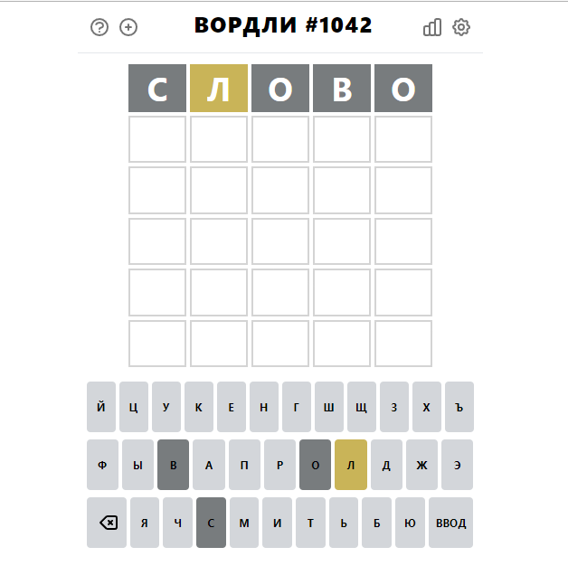

<!-- _footer: '[Wordle по-русски](https://wordle.belousov.one)' -->

---

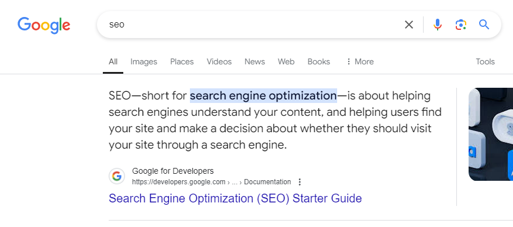

---

# За что платят бэкендеру?

---

<!-- _class: backend -->

* `Хранение и обработка данных`
* `API для веб- и мобильных приложений`
* `Эффективные алгоритмы`
* `Безопасность данных и компании`
* `Масштабируемость и отказоустойчивость`

---

# Как?

<span style="font-size: 0.5em">(frontend эдишен)</span>

---
<!--
- Три кита веб-разработки
- Javascript - это язык программирования, который выполняется в браузере.
- HTML - что показывается
- CSS - как выглядит
- JS - как оно себя ведёт
-->


*  - Что показывается на странице
*  - Как оно выглядит
*  - Как оно себя ведёт

---


---

# HTML

```html
<!DOCTYPE html>
<html lang="ru">
    <head>
        <meta name="viewport" content="width=device-width, initial-scale=1.0">
        <title>Document</title>
    </head>
    <body>
        <h1 class="heading">Привет, мир!</h1>
        <p class="paragraph">Этот текст может ничего не значить...</p>
    </body>
</html>
```

---

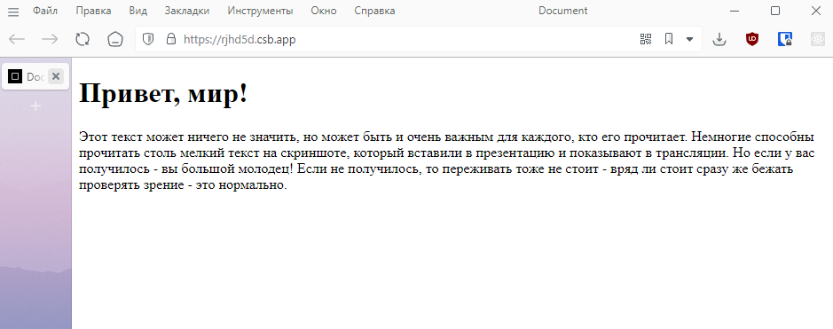

---

# CSS

```css
.heading {
    color: #850;
    font-size: 32px;
}

.paragraph {
    background-color: #f1c40f;
    border-radius: 8px;
}
```

---

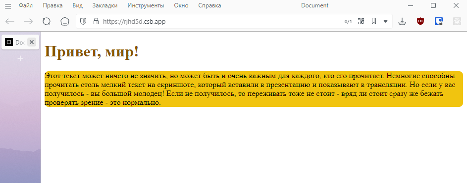

---

# JS

```js
let a = document.querySelector('.scared');
a.innerText = 'ой всё';
a.classList.add('away');

setTimeout(
    () => a.remove(),
    5000
)
```

---

<button class="scaredToo" onclick="javascript:(() => {let a = document.querySelector('.scaredToo'); a.innerText = 'ой всё'; a.classList.add('away'); setTimeout(() => a.remove(), 5000)})()">Я на грани</button>

---


<!-- _footer: '[Frontend Development Roadmap @ roadmap.sh](https://roadmap.sh/frontend)' -->

---


<!-- _footer: '[is-odd @ npmjs.org](https://www.npmjs.com/package/is-odd)' -->

---


---


---

<!-- _class: backend -->

# Как?

<span style="font-size: 0.5em">(backend эдишен)</span>

---

<!-- _class: backend -->

# [`https://roadmap.sh/backend`](https://roadmap.sh/backend)

---

# Остальные навыки

---

# Технические (hard skills)

* Редактор или IDE - рекомендация начинающим - [Visual Studio Code](https://aka.ms/vscode)
* Git и хранение исходного кода
* UNIX (shell) - умение работать в операционной системе
* Технические подробности устройства интернета
* Развёртывание приложений
* Автоматизация (в том числе сборки и развёртывания)
* Понимание своей сферы - методологии, фреймворки, хорошие практики

---

# Ещё технические, но уже не совсем

* Умение гуглить, читать документацию, задавать (в меру) глупые вопросы и применять новые знания
* Логическое мышление
* Алгоритмы и структуры данных (в основном на собеседованиях)
* Чистота, читаемость кода. Архитектура проекта
* Код-ревью

---

# Нетехнические (soft skills)

* Критика - как воспринимать, так и давать
* Компромиссы
* Понимание проблем. Зачем это всё?
* Процессы в команде и компании

---

# Карьера

---

<!-- _class: rotatingImg -->
# Предпочтения


---

# Перспективы


---


---


---

<!-- _class: screaming -->


# Зарплаты

---

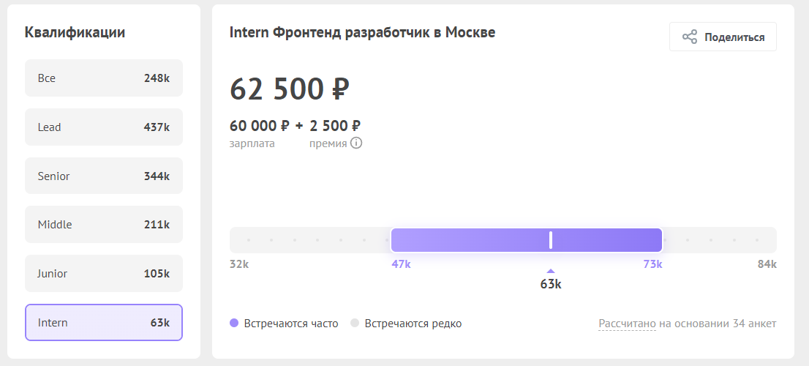

<!-- _footer: '[Хабр Карьера](https://career.habr.com/salaries?locations%5B%5D=c_678&qualification=Intern&spec_aliases%5B%5D=frontend)' -->
---


<!-- _footer: '[Хабр Карьера](https://career.habr.com/salaries?locations%5B%5D=c_678&qualification=Intern&spec_aliases%5B%5D=backend)' -->

---


---

# Работодатели

---

* Маркетинговые агенства
* Аутсорс/аутстафф
* Продуктовая компания
* Стартап
* Не-айти компания

---

# Как выбрать путь?

---

# Как изучать?

---

Будущим фронтендерам рекомендую для самостоятельного изучения:

- [Frontend Development Roadmap @ roadmap.sh](https://roadmap.sh/frontend)
- <https://stepik.org/course/38218/promo> бесплатный курс по HTML/CSS от моего товарища на stepik
- <https://learn.javascript.ru> - учебник по javascript
- <https://karmazzin.gitbook.io/eloquentjavascript_ru> - ещё один учебник по javascript

---

#### Cпасибо&excl;

<!-- _class: author screaming -->
<div class="author-card">
    
    <div class="author-text">
        <span class="author-name">Михаил Кононенко</span>
        <span class="author-tg"><a href="https://t.me/vbifonix"><i class="icon-send"></i>@vbifonix</a></span>
        <span class="author-resume">
            Фронтенд-разработчик в 
        </span>
    </div>
</div>

<div class="author-card">
    
    <div class="author-text">
        <span class="author-name">Тимофей Житков</span>
        <span class="author-tg"><a href="https://t.me/timondecathlon"><i class="icon-send"></i>@timondecathlon</a></span>
        <span class="author-resume">
            Senior Fullstack-разработчик в 
        </span>
    </div>
</div>
